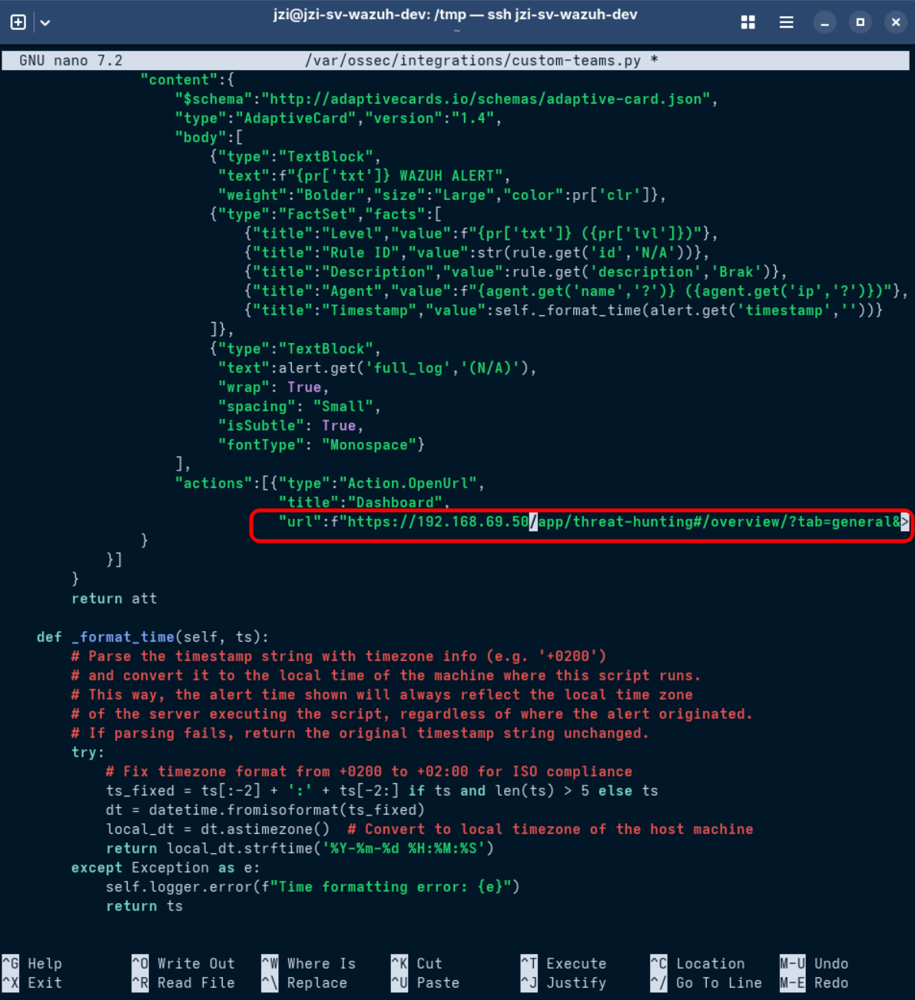

# wazuh-teams-workflows
[](https://opensource.org/licenses/MIT)
[](https://www.python.org/downloads/)
[](https://wazuh.com/)
---
> **ℹ️ Incoming Webhooks in Microsoft Teams (Office 365 Connectors) will be fully retired by December 2025.**
>
> - **New Incoming Webhook/Connector creation is blocked from August 15, 2024**.
> - **Existing connectors will require an URL update before December 31, 2024** to keep working.
> - **All Office 365 connectors/incoming webhook integrations will stop working entirely after December 31, 2025** (see [Microsoft's announcement][office365-retirement]).
>
> **This integration exists because Power Automate Workflows are now the Microsoft-recommended way to post alerts to Teams.**
>
> [office365-retirement]: https://devblogs.microsoft.com/microsoft365dev/retirement-of-office-365-connectors-within-microsoft-teams/
---
A comprehensive integration script that sends Wazuh security alerts directly to Microsoft Teams channels using Power Automate workflows. This integration supports modern Microsoft Teams webhooks and provides rich, formatted alert notifications with Adaptive Cards.

## Features

- 🔗 **Power Automate Integration**: Uses modern Microsoft Teams Power Automate workflows (logic.azure.com)
- 🎨 **Rich Formatting**: Adaptive Cards with color-coded priority levels and detailed alert information
- 🎯 **Flexible Filtering**: Configure alerts by rule ID, severity level, or both
- 🚀 **Easy Setup**: Simple installation and configuration process
### Alert Information Included

Each Teams notification includes:
- **Level**: With color coding  
- **Rule ID**: Wazuh rule identifier  
- **Description**: Rule description  
- **Agent**: Agent name  
- **Timestamp**: Alert time (local timezone)  
- **Full Log**: Complete log entry  
- **Dashboard Link**: Direct link to the Wazuh Dashboard Threat Hunting section for the agent that generated the alert (configurable)
## Requirements

### System Requirements
- **Wazuh Manager**: Version 4.0 or higher
- **Python**: Version 3.8 or higher (usually included with Wazuh)
- **Network**: HTTPS access to `logic.azure.com` (Power Automate)

### Microsoft Teams Requirements
- Microsoft Teams workspace with channel creation permissions
- Power Automate Free access (included in most Microsoft 365 plans)

## Installation

### Step 1: Download Integration Files

Download the integration files to your Wazuh manager:

```bash
# Create a temporary directory
cd /tmp
# Download scripts
wget https://raw.githubusercontent.com/jayzielinski/wazuh-teams-workflows/main/custom-teams
wget https://raw.githubusercontent.com/jayzielinski/wazuh-teams-workflows/main/custom-teams.py

```

### Step 2: Install Integration Scripts

Copy the files to the Wazuh integrations directory and set proper permissions:

```bash
# Copy files to Wazuh integrations directory
sudo cp custom-teams /var/ossec/integrations/
sudo cp custom-teams.py /var/ossec/integrations/

# Set proper ownership and permissions
sudo chown root:wazuh /var/ossec/integrations/custom-teams
sudo chmod 750 /var/ossec/integrations/custom-teams
sudo chown root:wazuh /var/ossec/integrations/custom-teams.py
sudo chmod 750 /var/ossec/integrations/custom-teams.py

# Verify installation
ls -la /var/ossec/integrations/
```

Expected output:
```
-rwxr-x--- 1 root wazuh  444 Jul 28 19:00 /var/ossec/integrations/custom-teams
-rwxr-x--- 1 root wazuh 7274 Jul 28 19:00 /var/ossec/integrations/custom-teams.py

```

### Step 3. Edit the Dashboard URL in `custom-teams.py`

> **ℹ️ Important:**  
> After copying the integration script, you **MUST** update the link to your Wazuh Dashboard in the notification card.  
> This ensures that the "Dashboard" button in Teams alerts correctly points to your environment.

### How to update the Dashboard link

1. **Open the integration script for editing:**
````
sudo nano /var/ossec/integrations/custom-teams.py
````
2. **Find the Adaptive Card `actions` section**  
(inside the `_make_card` function):
````
"actions": [{
"type": "Action.OpenUrl",
"title": "Dashboard",
"url": "https://your.wazuh.dashboard.ip/app/threat-hunting#/overview/?tab=general&tabView=events&_a=(filters:!(),query:(language:kuery,query:''))&_g=(filters:!(),refreshInterval:(pause:!t,value:0),time:(from:now-24h,to:now))&agentId={agent.get('id','')}"}]
````
3. **Replace** `your.wazuh.dashboard.ip` with your Dashboard's IP address or DNS name.
For example:
````
"url":f"https://192.168.69.50/app/threat-hunting#/overview/?tab=general&tabView=events&_a=(filters:!(),query:(language:kuery,query:''))&_g=(filters:!(),refreshInterval:(pause:!t,value:0),time:(from:now-24h,to:now))&agentId={agent.get('id','')}"}]
````

4. **Save** the file and **restart Wazuh Manager** for the changes to take effect:
````
sudo systemctl restart wazuh-manager
````
## Microsoft Teams Configuration

### Step 1: Create Power Automate Workflow

1. **Navigate to your Teams channel**
   - Open Microsoft Teams
   - Go to the channel where you want to receive alerts
   - Click the three dots (**...**) next to the channel name

2. **Add Workflow**
   - Select **"Workflows"** from the dropdown menu
     
   - Click **"Send webhook alerts to a channel"**
     
     
3. **Wait until the connection status changes to “Valid connection” and change the “Name” of the workflow. Click Next.**
   
 
4. **Configure Workflow**
   - **Team**: Select your team
   - **Channel**: Select your channel
   **Click "Add workflow"**
	 


5. **Copy Webhook URL**
   - After creation, copy the generated webhook URL
   - It should look like: `https://prod-XX.northeurope.logic.azure.com:443/workflows/...`
   - **Important**: Save this URL securely as you'll need it for Wazuh configuration
   - Click "Done"
     

## Wazuh Configuration

### Step 1: Configure ossec.conf

Edit the Wazuh configuration file:

```bash
sudo nano /var/ossec/etc/ossec.conf
```

Add the integration configuration.  
---
>ℹ️ You can enable notifications both for all alerts above a specified level and for selected specific rule IDs at the same time.
For example, it’s possible to receive Teams notifications for all critical alerts (e.g., level ≥ 11) and, simultaneously, for any alerts matching a list of specific rule IDs
---
#### Basic Configuration (All alerts level 10+)

```xml
<integration>
  <name>custom-teams</name>
  <hook_url>YOUR_TEAMS_WEBHOOK_URL_HERE</hook_url>
  <level>10</level>
  <alert_format>json</alert_format>
</integration>
```

#### Advanced Configuration (Specific Rules + All alerts level 10+)
---
>In my example, I want Teams to get all alerts from level 10 and above, plus some specific events for Linux and Windows.

>Linux:
>5710 – Login with a non-existent user
5712 – SSH bruteforce attack
>5902 – New user added
5404 – Three failed sudo attempts

>Windows:
>60204 – Bruteforce attack
>60109 – New user account created

This way, Teams will get both all alerts from level 10 up, and these particular events for Linux and Windows, just as examples.
---
```xml
<!-- Specific security rules -->
<integration>
  <name>custom-teams</name>
  <hook_url>YOUR_TEAMS_WEBHOOK_URL_HERE</hook_url>
  <rule_id>5710,5712,5902,5404,60204,60109</rule_id>
  <alert_format>json</alert_format>
</integration>

<!-- All critical alerts (level 10+) -->
<integration>
  <name>custom-teams</name>
  <hook_url>YOUR_TEAMS_WEBHOOK_URL_HERE</hook_url>
  <level>10</level>
  <alert_format>json</alert_format>
</integration>
```

### Step 2: Save & Restart Wazuh Manager
```bash
sudo systemctl restart wazuh-manager
```

## Testing the Integration

### Generate Alerts for Linux rule 5902
>In my case, I prepared two agents to perform the tests. One VM with Windows 11 Pro and the other VM with Ubuntu Server 24.04 LTS.

>
Create a test user on Linux Endpoint to trigger rule 5902:

```bash
sudo useradd testuser123
```

On Wazuh-Manager you can check integration logs:

```bash
sudo tail -f /var/ossec/logs/integrations.log
```

Expected log output:
```
2025-07-28 19:30:00 INFO Sent ok (status 202)
```

Check alert in Microsoft Teams Channel:

### Generate Alerts for Linux rule 5710


### Generate Alerts for Windows rule 60109


### Generate Alerts for Windows rule 60204
We will perform a test RDP bruteforce attack as shown in the screenshot below:


When you click the "Dashboard" button in Teams, you will be redirected to the "Threat Hunting Events" section in Wazuh, automatically filtered to show events for the agent related to the alert.


## Support

- **GitHub Issues**: [Report bugs or request features](https://github.com/jayzielinski/wazuh-teams-integration/issues)
- **Wazuh Community**: [Wazuh Community Forum](https://wazuh.com/community/)
- **Documentation**: [Wazuh Documentation](https://documentation.wazuh.com/)

## Contributing

Contributions, feedback, and pull requests are welcome! Please open an issue or create a PR.
